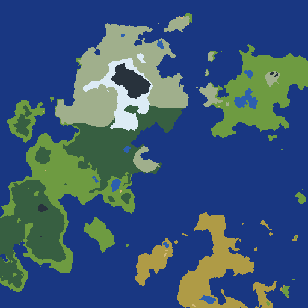
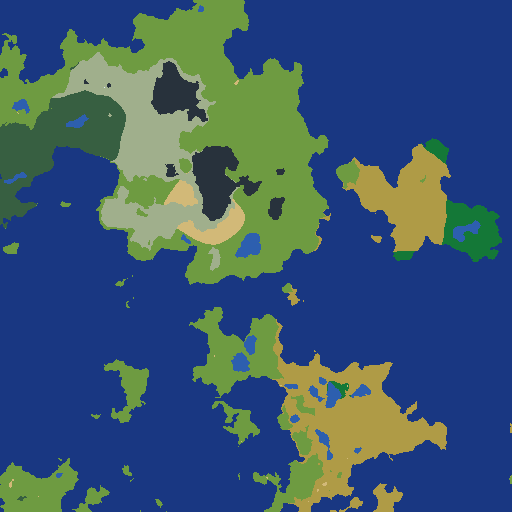
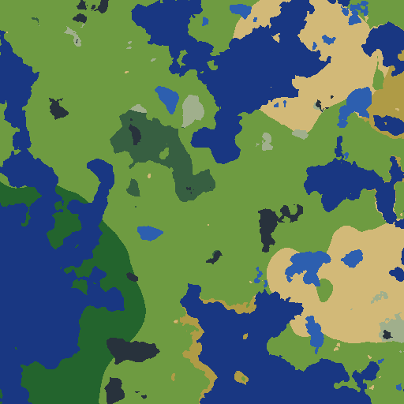
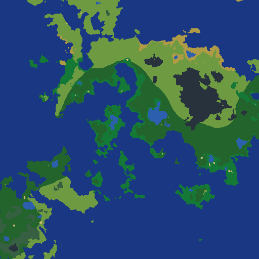

# Terraforge

Deterministic procedural 2D world map generation for games and tools.

Pipeline: **elevation → temperature → rainfall → water → biomes**

<p align="center">
  
  
  <br />
  
  
</p>

Requires stable Rust. The GUI binary needs `--features gui`.

## Install (Rust dependency)

```toml
terraforge = { git = "https://github.com/jmrfox/terraforge", tag = "v1.0.0" }
```

Pin a tag (or `rev = "<sha>"` during active development) so downstream builds stay reproducible.

## Using as a library dependency

Generation-only use does **not** require `--features gui`.

**Entry points**

- `generate_world(&WorldGenConfig)` — synchronous generation
- `generate_world_with_progress(config, progress)` — optional per-stage progress for large maps
- `WorldGenConfig::default()` or `serde_json` deserialize — load JSON presets
- `sample_default_config(sample_seed, map_seed)` — optional parameter exploration from built-in priors

**`WorldMap` output**

| Field | Range / type | Notes |
|-------|----------------|-------|
| `elevation`, `temperature`, `rainfall` | `[0, 1]` | Normalized simulation units |
| `water_mask` | `bool` | Land vs water |
| `dist_to_water` | `u32` | Chamfer distance to nearest water |
| `ridge_influence` | `[0, 1]` | Mountain-belt signal from elevation stage |
| `biome` | `Biome` | Final classification per cell |

Use `biome_to_id` and `LEGEND_ENTRIES` when you need stable numeric biome IDs. Within 1.x, IDs are fixed:

| ID | Biome |
|----|-------|
| 0 | Ocean |
| 1 | Lake |
| 2 | Ice |
| 3 | Tundra |
| 4 | Taiga |
| 5 | Grassland |
| 6 | TemperateForest |
| 7 | Desert |
| 8 | Savanna |
| 9 | TropicalForest |
| 10 | Mountain |

**Stability (v1.0)**

- `WorldGenConfig` JSON field names are the preset contract; major version bumps may require preset migration.
- The public API surface is `generate_world`, `WorldGenConfig`, `WorldMap`, export helpers in `preview`, and optional sampling in `priors`.

```rust
use terraforge::{WorldGenConfig, generate_world, sample_default_config};

let map = generate_world(&WorldGenConfig::default());

// Randomize numerical parameters from built-in priors (same as GUI "Sample & generate").
let sampled = sample_default_config(99, Some(42));
let random_world = generate_world(&sampled);
```

## Interactive GUI (`mapgui`)

Tweak generation parameters, preview biome/elevation/temperature/rainfall/water layers, and export PNG or JSON presets:

```bash
cargo run --features gui --bin mapgui
cargo run --release --features gui --bin mapgui   # faster generation
```

The app auto-generates on startup (default 512×512). Use **Generate** after changing parameters, or **Sample & generate** to draw numerical parameters from built-in priors and randomize the map seed. Load/save presets as JSON; export always writes the biome PNG.

## Headless map preview (`mapgen` CLI)

```bash
cargo run --bin mapgen -- -o out/map.png --width 512 --seed 42 --stats
cargo run --bin mapgen -- -o out/map.png --sample --stats
cargo run --bin mapgen -- -o out/map.png --sample --sample-seed 99 --seed 42 --stats
cargo run --bin mapgen -- -o out/map.tiff --format tiff --width 512 --seed 42 --stats
cargo run --bin mapgen -- --batch mapgen_presets/example_batch.json --out-dir out/ --stats
cargo run --bin mapgen -- --batch mapgen_presets/sample_batch.json --out-dir out/ --stats
cargo run --bin mapgen -- --batch mapgen_presets/example_batch.json --out-dir out/ --format tiff --stats
```

`--sample` draws enabled parameters from built-in priors centered on the tuned defaults (Earth-like ranges for climate, relief, and land fraction). Without `--seed`, a random map seed is chosen. Use `--sample-seed` to reproduce the parameter draw.

Full CLI flags: `cargo run --bin mapgen -- --help` (includes `--config` for JSON preset merge).

Multi-page TIFF output (use `--format tiff` or a `.tiff`/`.tif` extension). By default six pages are written:

| Page | Layer | Encoding |
|------|-------|----------|
| 0 | Biome preview | RGB8 |
| 1 | Elevation | 16-bit gray, `[0,1]` → full range |
| 2 | Temperature | 16-bit gray |
| 3 | Rainfall | 16-bit gray |
| 4 | Biome ID | 16-bit gray (0–10, legend in TIFF metadata) |
| 5 | Water mask | 8-bit gray |

Use `--tiff-layers default` for the legacy two-page export (biomes + elevation only), or pick layers explicitly:

```bash
cargo run --bin mapgen -- -o out/climate.tiff --format tiff --tiff-layers elevation,temperature,rainfall
```

Release builds are faster for large maps:

```bash
cargo run --release --bin mapgen -- -o out/map.png --width 512 --seed 42
```

## Batch diagnostics (`mapanalyze`)

Print aggregate map statistics across preset config variants (no file output):

```bash
cargo run --release --bin mapanalyze
cargo run --release --bin mapanalyze -- --seeds 42,7,99
```

## Tests

```bash
cargo test
```

## License

MIT — see [LICENSE-MIT](LICENSE-MIT).
